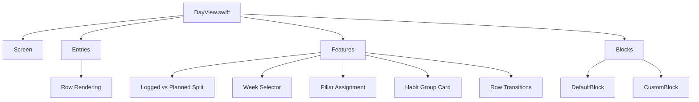

# DayView Architecture (Plain-English)

This folder powers the Day screen.

Think of it like this:
- `DayView.swift` is the screen shell (state + wiring).
- `Screen/` handles loading and top-level sheets.
- `Entries/` holds shared row helpers and summaries.
- `Features/` contains optional product capabilities in isolated files.
- `Blocks/` contains reusable block editors/renderers.

## Quick map

## Feature folders

- `Features/WeekSelector`: Date header and week switching UI.
- `Features/LoggedPlannedSplit`: The two-section layout and entry model builder.
- `Features/PillarAssignment`: Assigning pillars from Day rows.
- `Features/HabitGroupCard`: Habit group card summary + row behavior.
- `Features/RowTransitions`: Row movement/matched transition animation settings.

## Large renderer split

- `Blocks/DefaultBlock/` is now split by concern:
  - `DefaultBlockView.swift` (shell)
  - `DefaultBlockView+Presentation.swift` (title/icon/row visuals)
  - `DefaultBlockView+EditorSheet.swift` (sheet controls)
  - `DefaultBlockView+ContentRouting.swift` (chooses editor form)
  - `DefaultBlockView+SummaryValues.swift` (collapsed summary text logic)

- `Blocks/CustomBlock/` is now split by concern:
  - `CustomBlockView.swift` (shell)
  - `CustomBlockView+Editors.swift` (field UI)
  - `CustomBlockView+Bindings.swift` (value bindings)
  - `CustomBlockView+Defaults.swift` (defaults + safety rules)

## How to remove a feature safely

1. Delete its file(s) in `Features/<FeatureName>/`.
2. Remove the one call site from `DayView.swift` or the row router.
3. Build and confirm no compile references remain.

This keeps feature cleanup fast and low-risk.
